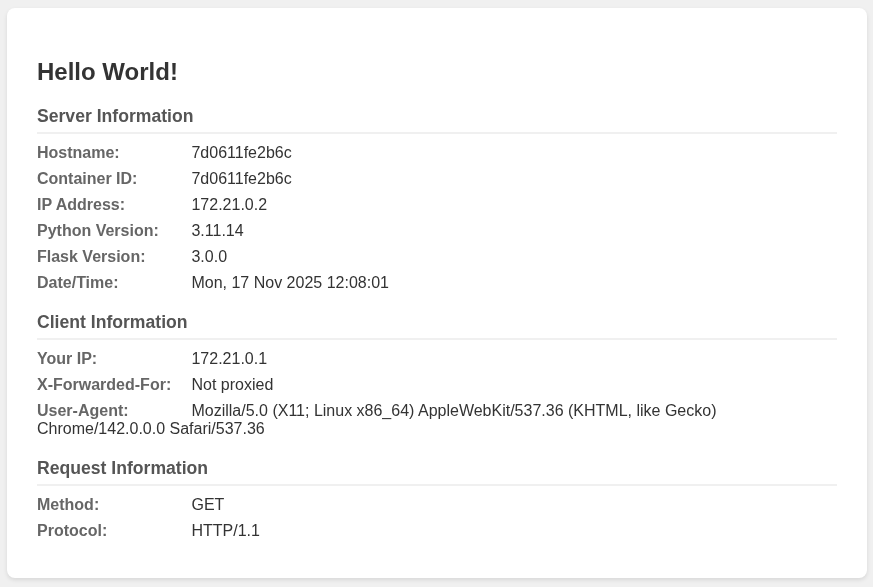

# Build a Simple Python Flask App
This app is very small and easy to understand, useful for getting to know Docker basics. Also, can be used in Docker Swarms or Kubernetes replica sets as it displays different host information when being load balanced.




## Run in local shell

### Prerequisities
```shell
python -m venv venv
source venv/bin/activate

python -m pip install -r requirements.txt
```
### Test source code
```bash
# export if script name not app.py
export FLASK_APP=app.py
flask run
# CTRL-C to exit
```

### Access with browser or curl
- Browser: [http://127.0.0.1:5000/](http://127.0.0.1:5000/)
- Curl: `curl -s http://127.0.0.1:5000/`

---
## Run in Docker

### Build image
```bash
docker build -t python-docker:latest .
```

### Start container with CLI
```bash
docker run -it -d --rm --name flask-app -p 5000:5000 python-docker:latest
```

### Stop container with CLI
```bash
docker container stop flask-app
```

### Start container with Compose
```bash
docker compose up -d
```

### Stop container with Compose
```bash
docker compose down
```

### Access with browser or curl
- Browser: [http://127.0.0.1:5000/](http://127.0.0.1:5000/)
- Curl: `curl -s http://127.0.0.1:5000/`


## Troubleshooting
- Getting port errors... do not run both script and container at same time or, change port 5000 to an unused port


...
